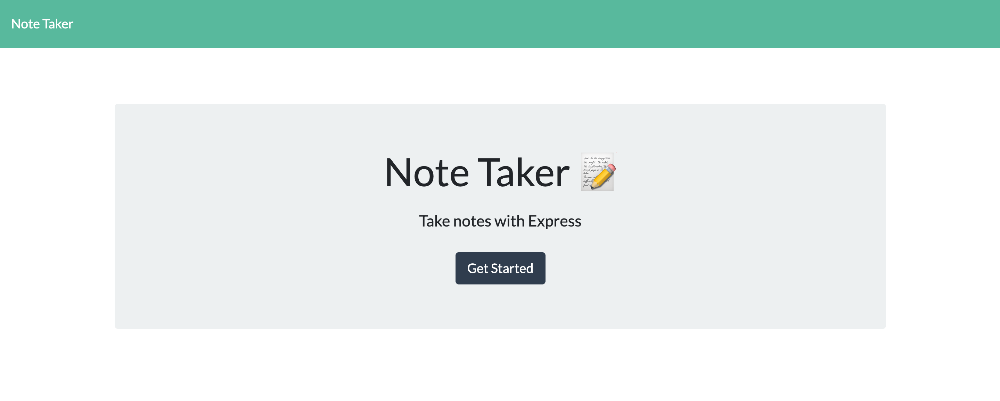
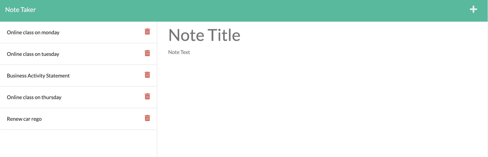
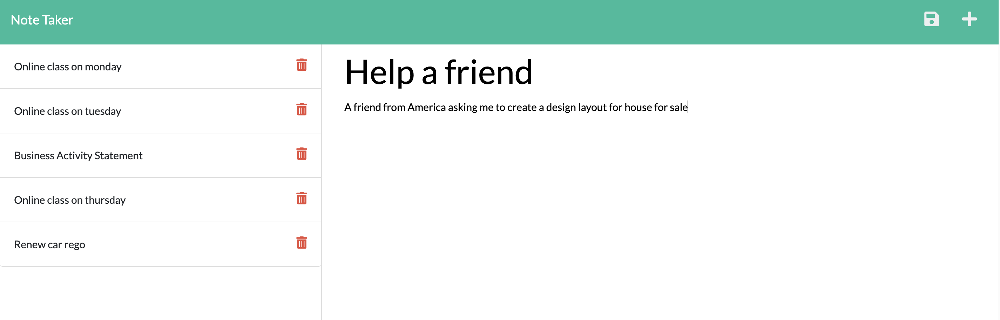
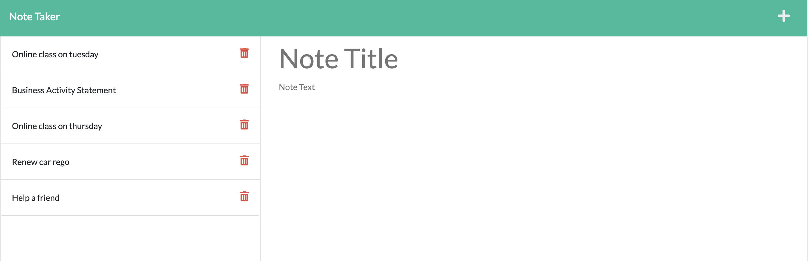

# Note-Taker

  

## Description
This application called Note Taker that can be used to write and save notes. You can organize your thoughts and keep track of tasks you need to complete. This application use an Express.js back end and will save and retrieve note data form a JSON file, using `fs` module. I was created HTML routes called web.js: `get /notes` should return the `notes.html` file and `get/` should return the `index.html` file. Also I was created API routes called api.js: `get /api/notes` should read `db.json` file and return all saves notes as JSON and `post /api/notes` should receive a new note to save on the request body, add it to the `db.json` file, and then return the new note to the client, also `delete /api/notes/:id` should receive a query parameter that contains the id of a note to delete.  The user can create, read, update and delete notes, if they don't need anymore. I was connected the back end and the front end and then deploy the entire application to heroku.

## Table of Contents (Optional)
- [Installation](#installation)
- [Usage](#usage)
- [Credits](#credits)
- [License](#license)
- [Badge](#badge)
- [Features](#features)
- [Contributing](#contributing)
- [Tests](#tests)
- [Questions](#questions)

## Installation
Create `.gitignore` and include `node_modules`, then install `npm` to acquire inquirer package. Make sure to install ` npm install express`. Install `npm i -D nodemon` and change on packege Json "script"; {"watch": "nodemon server.js"}. Also you need to install `npm i uuid` to generate crytographiically strong unique identifiers with Node js. Install Heroku in macOS `brew tap heroku/brew && brew install heroku` so I can deploy the entire application to Heroku.

## Usage
Open the Note Taker app on the heroku, the user is presented with a landing page with a link to a notes page. When the user click on the Get Started button, the user is presented with a page with existing notes listed in the left-hand column, plus empty fields to enter a new note title and the note's text in the right hand column. When the user enter a new note title and the note's text, then a save icon appears in the navigation at the top-right of the page.
When the user click on the save icon, then the new note the user have entered is saved and appears in the left-hand column with the other existing notes. When the user on an existing note in the list in the left-hand column, then that note appears in the right-hand column. When the user click on the plus icon navigation in the navigation at the top-right of the page, then the user is presented with empty fields to enter a new note title and the note's text in the right-hand column. When the user want to delete the existing note, then click on the delete icon where a note will be deleted on the left-hand column.

## Demo

- Heroku link: 

## Credits
- https://github.com/Simon-Xu-Lan

- https://github.com/sam-ngu

## License
    This application is covered by the MIT license.

---
## Badge

## Features
n/a

## Contributing
Pull request are welcome, you can make a constribution at the bottom of any docs page to make small changes such as a typo, sentence fix or a broken link. For major changes, please open an issue first to discuss what you would like to change.

## Tests
Run `node server.js` and entered, then run `npm watch` on your terminal, and will appear app is running `[nodemon] starting node server.js` and you can open `index.html` on the browser `localhost:3001/notes` and you are presented the Note Taker landing page. If there is an error you can read the message on the terminal, you open from vsCode. 

## Questions

If you have any question, Email me at: djaja@iinet.net.au 

Find me on GitHub: [B-smd](https://github.com/B-smd)   
